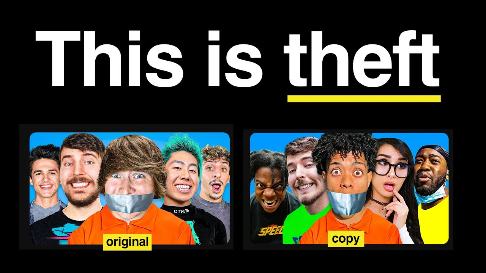

# some-one-like-you

## Some One Like You

### Introduction

[https://github.com/vietphan1995/some-one-like-you.git](https://github.com/vietphan1995/some-one-like-you.git)

Some One Like You is a software platform acts as copyright finder by big data and artificial intelligence technology.

Some One Like You finder receives origin content input and gives same content output on variety sources with followed input content extract features information.

Some One Like You insurance helps you register your creative content by uploading yours first then upload on other platform, this means it receive finder and copyright requirement.

Some One Like You reduces 100% content copycat problem for distribute view, make money purpose, duplicate content, edit content. In long term it’s copyright laws/rules can be built itself by region culture also the world, by reporter in human or artificial intelligence assistance.

### [back to git projects …](https://github.com/vietphan1995/projects)

### Notes
https://phantrungviet.notion.site/some-one-like-you-1d75e832d6ee8005bee6cdef76b4691f